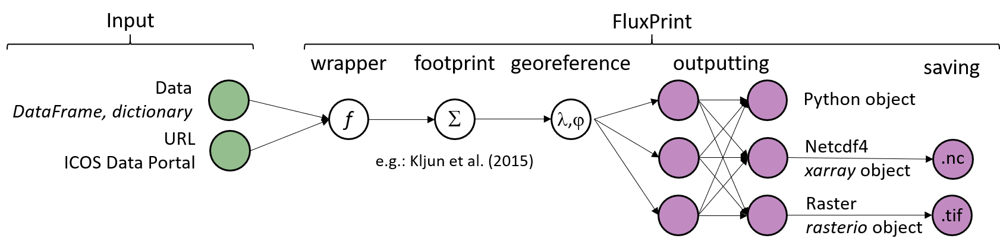

# FluxPrint

`FluxPrint` is an open-source Python package implementing flux footprint models
for eddy covariance data analysis. It provides footprint-model implementations
behind a single, consistent interface so researchers can compare spatially
resolved fluxes with field measurements, and add new models by following a small
convention. It is designed for interoperability with ecosystem flux datasets
(e.g. FLUXNET). See Figure 1 for the conceptual scheme.

<picture>
  <source media="(prefers-color-scheme: dark)" srcset="assets/conceptual_scheme_dark.png">
  <source media="(prefers-color-scheme: light)" srcset="assets/conceptual_scheme.png">
  
</picture>

*Figure 1. Conceptual scheme for FluxPrint.*

---

## Features

- **Footprint models** behind one interface, selected by name (currently
  Kljun et al., 2015; Kormann & Meixner, 2001 and Hsieh et al., 2000 are planned).
- **A typed footprint object** (`Footprint`): a 2-D source-area field on a fixed
  grid centred on the tower, plus `FootprintSeries` for time-ordered stacks.
- **Two coordinate frames**: a local, tower-centred metric grid, and a
  georeferenced projected grid (`georeference()`); lon/lat is display-only.
- **Serialization**: NetCDF is the native format, with GeoTIFF conversion.
- **Aggregation**: collapse a `FootprintSeries` into a climatology.

---

## Installation

From source:

```bash
pip install git+https://github.com/pedrohenriquecoimbra/fluxprint
```

The footprint object itself only needs `numpy`/`scipy`, and imports its IO
backends (`xarray`, `rasterio`, `pyproj`) lazily. Importing the full package
currently also pulls those libraries plus `pandas`, `matplotlib`, `requests`,
and [`regorator`](https://github.com/pedrohenriquecoimbra/regorator); a future
release will move the heavy libraries into optional extras
(`fluxprint[netcdf]`, `fluxprint[tiff]`, `fluxprint[crs]`, `fluxprint[shapefile]`).

---

## Quickstart

### Compute a footprint

```python
from fluxprint.model import get_model

kljun = get_model("kljun2015")
fp = kljun(
    zm=2.0,          # measurement height above displacement [m]
    z0=0.01,         # roughness length [m]  (or pass umean instead)
    ustar=0.5,       # friction velocity [m s-1]
    pblh=1000.0,     # boundary-layer height [m]
    mo_length=-50.0, # Obukhov length [m]
    v_sigma=0.5,     # std. dev. of lateral velocity [m s-1]
    wind_dir=180.0,  # wind direction [deg] (orients the grid north-up)
    dx=2.0,          # grid spacing [m]
    tower=(4321000.0, 3210000.0),  # tower position, for georeferencing
    tower_crs="EPSG:3035",
)

fp.total()    # ~ fraction of the flux captured by the grid
fp.peak_xy()  # (x, y) of the footprint peak, metres from the tower
```

Inputs may be scalars (one record) or equal-length sequences (composited into a
single footprint, `fp.n` records).

### Georeference and export

```python
geo = fp.georeference("EPSG:3035")  # local metres -> projected coords (needs pyproj)
geo.to_netcdf("footprint.nc")       # needs xarray
geo.to_tiff("footprint.tif")        # needs rasterio
```

### Build a climatology from a series

```python
from datetime import datetime, timedelta
from fluxprint.footprint import FootprintSeries

t0 = datetime(2024, 4, 24)
fps = [
    kljun(time=t0 + timedelta(minutes=30 * i),
          tower=(4321000.0, 3210000.0), tower_crs="EPSG:3035", **record)
    for i, record in enumerate(records)   # records: per-interval input dicts
]

series = FootprintSeries(fps)   # (time, y, x) stack on one shared grid
climatology = series.aggregate()  # 2-D mean footprint (time=None)
series.to_netcdf("series.nc")
```

---

## Adding a model

A model is a callable mapping micrometeorological inputs to one 2-D `Footprint`
in the local frame. Register it by name and it becomes selectable everywhere:

```python
from fluxprint.model import register_model
from fluxprint.footprint import Footprint

@register_model("my_model", description="My footprint parameterisation")
def calc(*, zm, ustar, pblh, mo_length, v_sigma, wind_dir, z0=None, umean=None,
         domain=None, dx=None, dy=None, tower=None, tower_crs=None, time=None,
         **kwargs) -> Footprint:
    f = ...  # 2-D field on a regular grid centred on the tower
    return Footprint.from_grid(f, dx=dx, tower=tower, tower_crs=tower_crs, time=time)
```

```python
from fluxprint.model import available_models, get_model
available_models()        # ['kljun2015', 'my_model']
get_model("my_model")(...)
```

The registry is backed by `regorator`.

---

## API reference

### `fluxprint.model`
- `get_model(name)` — return the registered model callable.
- `available_models()` — list registered model names.
- `register_model(name, description="", **attrs)` — decorator to register a model.
- `FootprintModel` — the callable protocol models conform to.

### `fluxprint.footprint.Footprint`
- `Footprint.from_grid(f, dx, dy=None, **meta)` — build a local, tower-centred footprint.
- `georeference(target_crs)` / `to_lonlat()` — local → projected; display lon/lat.
- `total()`, `peak_xy()`, `normalized()` — analysis helpers.
- `to_netcdf` / `from_netcdf`, `to_tiff` / `from_tiff`, `to_xarray` / `from_xarray`.

### `fluxprint.footprint.FootprintSeries`
- `aggregate(smooth=True)` — collapse the stack to a 2-D climatology.
- `georeference(target_crs)`, `to_netcdf` / `from_netcdf`, `to_xarray` / `from_xarray`.

> **Status:** the batch helper `core.calculate_footprint` (group a table by a
> column and footprint each group) is being reworked to return a
> `FootprintSeries`; until then its older return shape may change.

---

## Examples

See the `sample/` directory for usage examples.

---

## Contributing

Contributions are welcome — fork the repository, create a branch for your change,
and open a pull request.

---

## License

Licensed under the European Union Public Licence v. 1.2 (EUPL-1.2). See the
[LICENSE](LICENSE) file for details.

---

## Acknowledgments

- Kljun, N., Calanca, P., Rotach, M. W., Schmid, H. P. (2015): *The simple
  two-dimensional parameterisation for Flux Footprint Predictions (FFP)*,
  Geosci. Model Dev. 8, 3695–3713, doi:10.5194/gmd-8-3695-2015.
- Kormann, R., Meixner, F. X. (2001): *An analytical footprint model for
  non-neutral stratification*, Boundary-Layer Meteorol. 99, 207–224,
  doi:10.1023/A:1018991015119.

---

## Contact

- [Pedro Henrique Coimbra](mailto:pedro-henrique.herig-coimbra@inrae.fr)
- [GitHub Issues](https://github.com/pedrohenriquecoimbra/fluxprint/issues)
